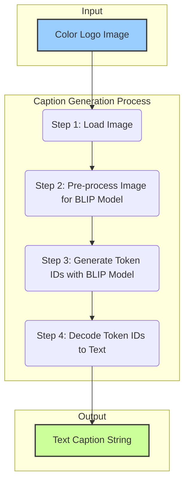

# Documentation: `3_generate_captions.py`

This document provides a detailed explanation of the `3_generate_captions.py` script. Its purpose is to automatically generate a descriptive text caption for each logo image in our dataset.

## 1. High-Level Purpose

The goal of this script is to create our third and final "conditioning" dataset: a text description for every logo. This caption serves as a semantic guide for our final AI model. It allows the model to learn the connection between visual concepts (e.g., the image of a lion) and the words that describe them ("a logo of a lion's head"). This enables powerful text-to-image generation capabilities.

The script processes all images from `data/logos/cleaned`, generates a caption for each, and stores the results in a single structured JSON file at `data/captions.json`.

---

## 2. The Caption Generation Algorithm

This script leverages a large, pre-trained multimodal AI model to perform the complex task of image captioning. The core logic is handled by the `generate_caption` function.

### Key Technologies
*   **Hugging Face `transformers`:** A popular open-source library that provides easy access to a vast collection of pre-trained AI models. It handles the complexity of downloading, caching, and running these models.
*   **BLIP (Bootstrapping Language-Image Pre-training):** A state-of-the-art image captioning model developed by Salesforce Research. It has been pre-trained on a massive dataset of images and text, enabling it to generate coherent and relevant descriptions for a wide variety of images.

### Visual Flowchart of the Algorithm

This flowchart illustrates the process for generating a caption for a single image:

### Step-by-Step Code Explanation

Let's break down the concepts behind each step.

#### **Step 1: Load Image**
- **Code:** `img = Image.open(image_path).convert('RGB')`
- **Concept:** The image is loaded from the file path and converted to the RGB color space.
- **Why it's done:** This ensures a consistent 3-channel color format, which the BLIP model expects as input. It removes any transparency layers from PNG files.

#### **Step 2: Pre-process Image for BLIP Model**
- **Code:** `inputs = processor(images=img, return_tensors="pt").to(device)`
- **Concept:** AI models don't "see" images as we do. They require the data to be in a very specific numerical format called a **tensor**. The `BlipProcessor` is a special tool provided with the model that handles this conversion. It automatically resizes the image, normalizes the color values to a specific range, and structures it all as a PyTorch tensor.
- **Why it's done:** This is a mandatory step. Feeding a raw image file to a model would be like trying to run a car on crude oil. The processor "refines" the image data into the "fuel" the model can understand. `.to(device)` moves this tensor to the GPU for faster processing.

#### **Step 3: Generate Token IDs with BLIP Model**
- **Code:** `output_ids = model.generate(**inputs, max_length=50)`
- **Concept:** This is the core inference step. The pre-processed image tensor is fed into the `model`. The BLIP model, with its billions of internal parameters, analyzes the image and produces a sequence of numbers (`output_ids`). Each number, or "token ID," corresponds to a word or sub-word in its vast vocabulary.
- **Why it's done:** This is the model's way of "writing" its description. It doesn't output text directly, but rather the numerical codes for the text it wants to generate.

#### **Step 4: Decode Token IDs to Text**
- **Code:** `caption = processor.decode(output_ids[0], skip_special_tokens=True)`
- **Concept:** The `processor` is used again, this time in reverse. The `decode` method acts as a dictionary, looking up each token ID and converting it back into a human-readable word. It then joins these words to form the final caption.
- **Why it's done:** This translates the model's numerical output into the final string of text that we can read and save.

---

## 3. The Manager Function (`process_images_for_captions`)

This function orchestrates the entire captioning pipeline for the full dataset.
1.  **Model Initialization:** It downloads and loads the BLIP model and its processor from Hugging Face **once** at the start. This is a critical optimization to avoid re-downloading the large model for every image. It also detects and prepares the GPU (`cuda`) if available.
2.  **File Discovery:** It recursively finds all image files in the `data/logos/cleaned` directory.
3.  **Iteration:** It loops through every image path, displaying a `tqdm` progress bar to monitor the long-running process.
4.  **Data Collection:** For each image, it calls `generate_caption` and stores the returned caption in a dictionary, using the relative file path as the key.
5.  **Saving to JSON:** After all images have been captioned, it saves the complete dictionary of captions into the `data/captions.json` file.
