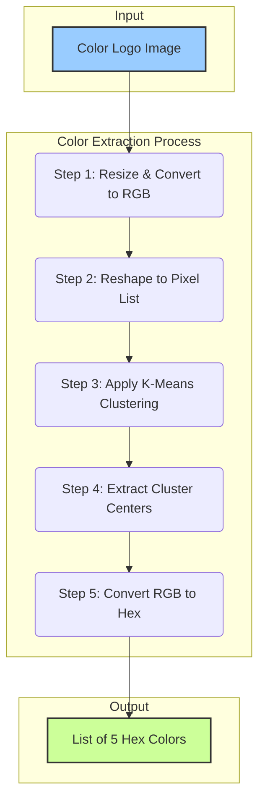

# Documentation: `2_extract_colors.py`

This document provides a detailed explanation of the `2_extract_colors.py` script. Its purpose is to analyze each logo image and extract a palette of its 5 most dominant colors.

## 1. High-Level Purpose

The goal of this script is to create our second "conditioning" dataset: a color palette for every logo. By identifying the key colors, we can later instruct our AI model to generate a logo using a specific color scheme. This gives us control over the final output's look and feel.

The script processes all images from `data/logos/cleaned`, calculates the dominant colors for each, and stores all of this information in a single structured JSON file located at `data/color_palettes.json`.

---

## 2. The Color Extraction Algorithm

The core of this script is the `extract_dominant_colors` function, which uses a powerful and popular machine learning algorithm called **K-Means Clustering** to objectively determine the most representative colors in an image.

### Visual Flowchart of the Algorithm

This flowchart illustrates the process for a single image:

### Step-by-Step Code Explanation

Let's explore the concepts behind each step.

#### **Step 1: Resize & Convert to RGB**
- **Code:** `img = img.convert('RGB'); img = img.resize((100, 100))`
- **Concept:** Before processing, we standardize the images. Converting to 'RGB' handles transparent backgrounds (in PNGs, for example) by replacing them with black, ensuring every pixel has 3 color channels (Red, Green, Blue). Resizing the image to a small thumbnail (100x100 pixels) drastically reduces the number of pixels we need to analyze.
- **Why it's done:** This step is for efficiency. A 256x256 image has 65,536 pixels, while a 100x100 image has only 10,000. This makes the clustering computation much faster, and since we only care about the overall color profile, this downscaling doesn't lose any critical information.

#### **Step 2: Reshape to Pixel List**
- **Code:** `pixels = np.array(img).reshape(-1, 3)`
- **Concept:** The K-Means algorithm needs data in a specific format: a list of data points. Here, we convert the 2D grid of pixels into a single, long list where each item is a triplet of numbers `[R, G, B]`.
- **Why it's done:** This formats the image data so it can be treated as a collection of points in a 3D "color space," which is exactly what the clustering algorithm is designed to work with.

#### **Step 3: Apply K-Means Clustering**
- **Code:** `kmeans = KMeans(n_clusters=5, ...); kmeans.fit(pixels)`
- **Concept:** K-Means Clustering is an unsupervised machine learning algorithm used to find groups (clusters) in data. In our case, the "data" is the list of all pixels.
- **How it works visually:**
    1.  Imagine a 3D cube where the axes are Red, Green, and Blue. Every pixel from the image is a point inside this cube.
    2.  The algorithm randomly places 5 "centroids" (we chose 5 with `n_clusters=5`) inside this cube.
    3.  It then assigns every pixel-point to its closest centroid. This creates 5 groups of pixels.
    4.  It calculates the average color of all pixels in a group and moves the centroid to that average position.
    5.  It repeats steps 3 and 4 until the centroids stop moving significantly.
- **Why it's done:** The final positions of these 5 centroids represent the 5 most dominant, or representative, colors in the image. It's a robust way to find a color palette automatically.

#### **Step 4: Extract Cluster Centers**
- **Code:** `colors = kmeans.cluster_centers_.astype(int)`
- **Concept:** After the `fit` process is complete, the `kmeans.cluster_centers_` attribute holds the final coordinates (the RGB values) of the 5 centroids.
- **Why it's done:** This is how we get our final 5 dominant RGB color values from the algorithm.

#### **Step 5: Convert RGB to Hex**
- **Code:** `hex_colors = [f"#{r:02x}{g:02x}{b:02x}" for r, g, b in colors]`
- **Concept:** This step converts the numerical RGB values (e.g., `[220, 50, 47]`) into a standard, web-friendly hexadecimal string (e.g., `"#dc322f"`). The `:02x` formatting ensures that each color component is represented by two hexadecimal characters.
- **Why it's done:** Hex codes are a compact and standard way to represent colors in web pages, design tools, and, importantly for us, in our final JSON data file.

---

## 4. The Manager Function (`process_images_for_colors`)

This function orchestrates the entire process for the full dataset.
1.  **Initialization:** It creates an empty dictionary, `color_data`, which will hold all our results.
2.  **File Discovery:** Just like the sketch script, it recursively finds all image files in the `data/logos/cleaned` directory.
3.  **Iteration:** It loops through every image path, displaying a `tqdm` progress bar.
4.  **Data Collection:** For each image, it calls `extract_dominant_colors` and stores the returned list of hex colors in the `color_data` dictionary. The key for each entry is the image's relative path, ensuring we can always link a palette back to its original image.
5.  **Saving to JSON:** Once all images have been processed, it uses Python's `json` library to dump the entire `color_data` dictionary into a single, neatly formatted file: `data/color_palettes.json`. Using a single file is efficient for this kind of data, as it's faster to load one large file than thousands of small ones.
