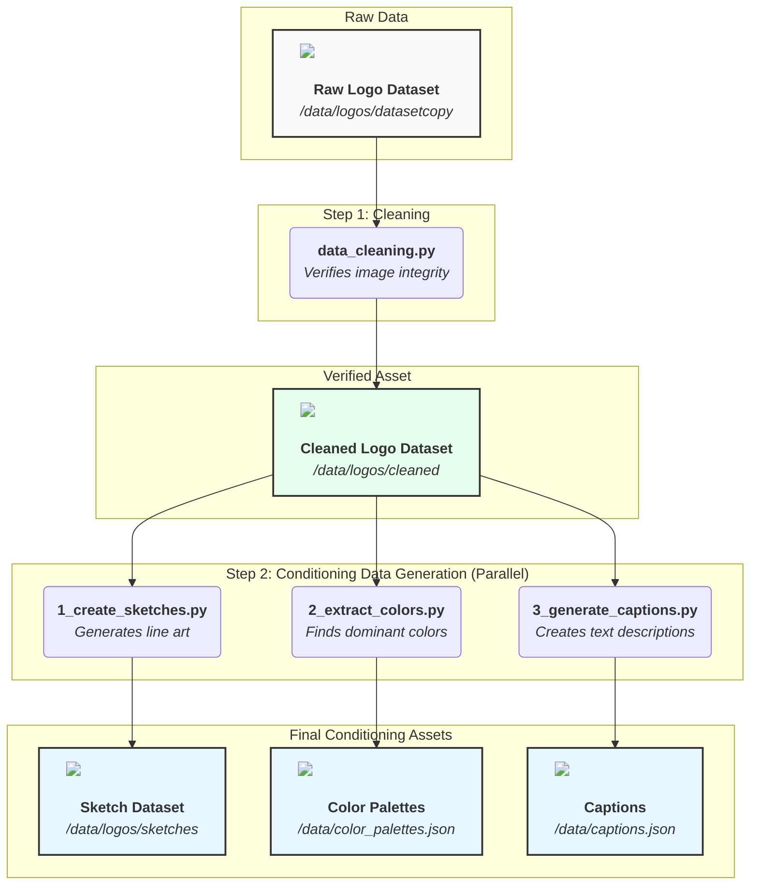
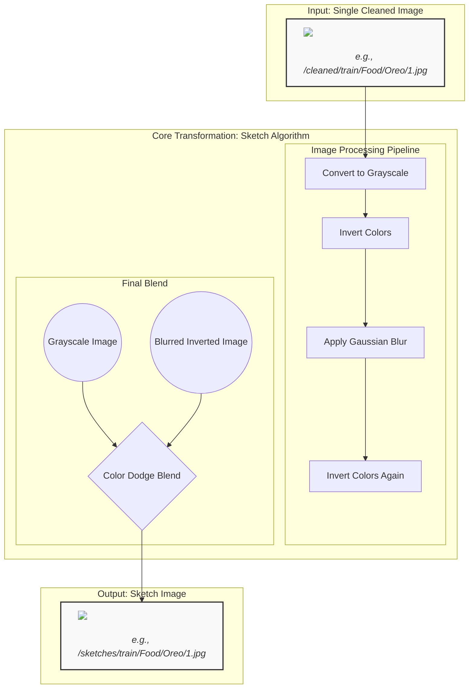

# Documentation: Phase 1 Visual Summary

This document provides a high-level visual overview of the entire data asset generation pipeline (Phase 1). It includes detailed "explainer block" diagrams for each of the three core processing scripts.

---

## 1. End-to-End Data Generation Pipeline (Phase 1)

This diagram illustrates the complete workflow, showing how we start with raw data and end with three distinct "conditioning" assets ready for the final metadata assembly.



---

## 2. Explainer Block Diagrams

These diagrams provide a more detailed, "tech-company-style" look into the internal logic of each script.

### **Script 1: `1_create_sketches.py`**

<br/>



### **Script 2: `2_extract_colors.py`**

<br/>

```mermaid
graph TD
    subgraph "Input: Single Cleaned Image"
        InputImg[<br/><i>e.g., /cleaned/train/Food/Oreo/1.jpg</i>]
    end

    subgraph "Core Transformation: K-Means Clustering"
        A[Resize & Convert to Pixel List] --> B{Plot Pixels in 3D RGB Space};
        B --> C[Find 5 Cluster Centroids (K-Means)];
        C --> D[Extract Centroid RGB Values];
    end
    
    subgraph "Output: JSON Data Entry"
        OutputJSON[<br/><i>"train/Food/Oreo/1.jpg":<br/>["#000000", "#ffffff", ...]</i>]
    end

    InputImg --> A;
    D --> OutputJSON;

    style InputImg fill:#f9f9f9,stroke:#333,stroke-width:2px
    style OutputJSON fill:#f9f9f9,stroke:#333,stroke-width:2px
```

### **Script 3: `3_generate_captions.py`**

<br/>

```mermaid
graph TD
    subgraph "Input: Single Cleaned Image"
        InputImg[<br/><i>e.g., /cleaned/train/Food/Oreo/1.jpg</i>]
    end

    subgraph "Core Transformation: BLIP Model Inference"
        A[Pre-process Image to Tensor] --> B{BLIP Model};
        B -- Generates --> C[Sequence of Token IDs];
        C --> D[Decode IDs to Text];
    end
    
    subgraph "Output: JSON Data Entry"
        OutputJSON[<br/><i>"train/Food/Oreo/1.jpg":<br/>"a black and white logo..."</i>]
    end

    InputImg --> A;
    D --> OutputJSON;

    style InputImg fill:#f9f9f9,stroke:#333,stroke-width:2px
    style OutputJSON fill:#f9f9f9,stroke:#333,stroke-width:2px
```
