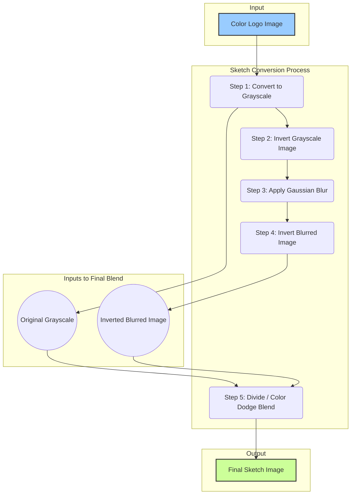

# Documentation: `1_create_sketches.py`

This document provides a detailed explanation of the `1_create_sketches.py` script, its purpose, its algorithm, and the computer vision concepts it uses.

## 1. High-Level Purpose

The primary goal of this script is to automate the creation of a "pencil sketch" dataset from a source dataset of clean logo images. This is the first of three "conditioning" datasets we will generate. The final AI model will use these sketches as a strong hint to control the shape and structure of the logos it generates.

The script takes all images from `data/logos/cleaned` and produces a corresponding sketch image in `data/logos/sketches`, preserving the exact directory structure.

---

## 2. The Sketch Generation Algorithm

The core of the script is the `create_sketch` function, which transforms a single image. This function uses a clever technique that leverages image blending modes to simulate the appearance of a hand-drawn sketch.

### Visual Flowchart of the Algorithm

Here is a visual representation of the steps involved in converting one color image into a sketch:

### Step-by-Step Code Explanation

Let's break down each step from the flowchart and the corresponding code.

#### **Step 1: Convert to Grayscale**
- **Code:** `grey_img = cv2.cvtColor(img, cv2.COLOR_BGR2GRAY)`
- **Concept:** A grayscale image removes all color information (hue, saturation) and retains only the luminance (brightness) of each pixel. This is essential because sketches are fundamentally about light, shadow, and form, not color.
- **Why it's done:** This simplifies the image to its core structure, making it easier to detect edges and lines.

#### **Step 2: Invert the Grayscale Image**
- **Code:** `invert_img = cv2.bitwise_not(grey_img)`
- **Concept:** Image inversion flips the pixel values. In an 8-bit grayscale image, pixel values range from 0 (black) to 255 (white). Inversion subtracts the pixel value from 255. So, 0 becomes 255, 255 becomes 0, and 100 becomes 155. This creates a "photo negative" effect.
- **Why it's done:** This is a preparatory step for the Color Dodge blending trick. By inverting the image, we set up the dark areas to become light and vice-versa, which is crucial for how the blur will affect the final lines.

#### **Step 3: Apply Gaussian Blur**
- **Code:** `blur_img = cv2.GaussianBlur(invert_img, (21, 21), 0)`
- **Concept:** A Gaussian Blur is a filter that smooths an image by averaging the pixel values with their neighbors. The `(21, 21)` kernel size defines the area of neighbors to consider; a larger kernel results in a stronger blur. It's a "Gaussian" blur because the averaging is weighted, giving more importance to closer pixels, following a bell curve (Gaussian distribution).
- **Why it's done:** This is the most artistic step. Blurring the inverted image softens the lines and spreads the light areas. The amount of blur directly impacts the thickness and softness of the final sketch lines. A larger blur value will make the lines in the final sketch appear thicker and more pronounced.

#### **Step 4: Invert the Blurred Image**
- **Code:** `invblur_img = cv2.bitwise_not(blur_img)`
- **Concept:** We simply invert the image again, reversing the negative effect from Step 2.
- **Why it's done:** Now we have a blurred version of the original grayscale image. The key difference is that the edges are now much softer and spread out compared to the sharp original.

#### **Step 5: Divide / Color Dodge Blend**
- **Code:** `sketch_img = cv2.divide(grey_img, invblur_img, scale=256.0)`
- **Concept:** This is the final and most important step. The `cv2.divide` function performs a "Color Dodge" blend. For each pixel, it divides the value in the bottom layer (the original grayscale image) by the inverted value of the top layer (the inverted blurred image).
- **How it works:**
    - If a pixel in the inverted blur image is white (255), dividing by it results in a very bright value, effectively making the output pixel white. This happens in all the flat areas of the logo.
    - If a pixel in the inverted blur image is dark (e.g., a blurred edge), dividing by this smaller number results in a much darker output pixel. This is what creates the pencil lines.
- **Why it's done:** This mathematical operation is a highly effective way to highlight the differences between the sharp original and the blurred version, isolating the lines and creating a convincing sketch effect. The `scale=256.0` parameter ensures the result is properly scaled to the full 0-255 brightness range.

---

## 3. The Manager Function (`process_images_to_sketches`)

While `create_sketch` handles one image, the `process_images_to_sketches` function manages the entire dataset. Its responsibilities are:
1.  **Directory Setup:** It creates the `data/logos/sketches` directory if it doesn't already exist.
2.  **File Discovery:** It walks through every subdirectory of the `source_dir` (`data/logos/cleaned`) to find every single image file.
3.  **Iteration with Progress Bar:** It loops through the list of all found images. It uses the `tqdm` library to display a progress bar, which is essential for tracking the status of a long-running task.
4.  **Calling the Worker:** For each image path, it calls `create_sketch()` to perform the actual conversion.
5.  **Saving the Result:** It constructs a new path to save the sketch, carefully preserving the original subfolder structure (e.g., `train/Accessories/Nike/`). This is critical for keeping our dataset organized. It then saves the new sketch image to this path.

This separation of concerns—one function for the core logic and another for managing the process—is a very good programming practice.
